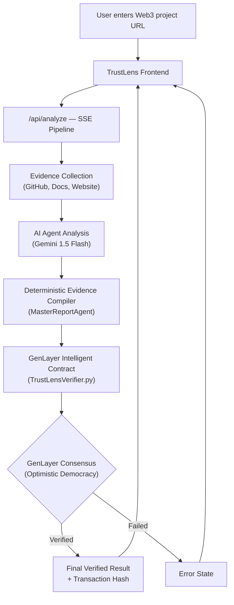

<div align="center">
  
  <h1>TrustLens (Powered by ProjectLens) 🔍</h1>
  <p><b>A GenLayer Web3 Due Diligence Integration</b></p>
  <p>An autonomous Intelligence pipeline that verifies Web3 project risk through GenLayer's AI-validated Intelligent Contracts.</p>
</div>

<p align="center">
  
  
  
  
  
</p>

---

## ⚡ Overview
**TrustLens** is a fully automated, verifiable Due Diligence Pipeline constructed for the GenLayer ecosystem. It transforms hours of manual smart contract auditing, web scraping, and protocol whitepaper digestion into an instantaneous analytical pipeline that is **verified on-chain through GenLayer's Optimistic Democracy**.

Traditional AI screening tools rely on a single, centralized LLM inference to judge a project, which can easily hallucinate or be manipulated. **TrustLens solves this by relying on GenLayer consensus:** multiple independent AI validators run the evaluation natively in the Intelligent Contract, ensuring no single entity controls the risk assessment.

## 🔴 The Problem Statement
Retail investors consistently lose millions of dollars into malicious, hollow, or functionally broken Web3 ecosystems. Evaluating modern protocols requires cross-referencing GitHub commits, checking smart contract security, and verifying deep Documentation layers. Centralized AI tools fail because you have to 'blindly trust' the platform's backend prompt wrapper.

## 🟢 The Solution (GenLayer Architecture)
TrustLens leverages the **ProjectLens AI collector pipeline** to autonomously scour a target protocol's GitHub, documentation, and architecture. 

Instead of terminating at a centralized score, it packages this evidence matrix and forwards it directly to the **TrustLens GenLayer Intelligent Contract**. The GenLayer validators independently analyze the evidence via `gl.eq_principle` non-deterministic execution, achieving on-chain consensus on the project's exact risk level, and outputting an immutable transaction ledger of the verification.

---

## ✨ Key Features
- **GenLayer On-Chain Verification:** Live integration with the `genlayer-js` SDK and GenVM Python Intelligent Contracts to replace centralized scoring with Optimistic Democracy.
- **Deterministic AI Collectors:** Advanced web crawlers and AST parsers map the project's actual infrastructure before it even reaches the contract.
- **Server-Sent Event Streaming (SSE):** Users interact with a stunning real-time CLI terminal emulator directly on the dashboard reflecting every collection state, ending dynamically when the GenLayer validators finalize consensus.
- **Evidence Cross-Linking:** Every Security 'Finding' provides raw, clickable evidence directly mapped to the source material.

---

## 🧠 Architecture & AI Multi-Agent Pipeline



---

## 🧮 The Intelligent Contract 
The contract (`contracts/TrustLensVerifier.py`) is written in Python for the GenLayer Virtual Machine.

It utilizes:
1. `@gl.public.write verify_project()`: The core target accepting the JSON evidence payload.
2. `gl.eq_principle`: Defines the equivalence principle for the multiple validators. For two evaluations to match in Optimistic Democracy, they must assign the exact same `risk_level`, `decision`, and trust scores within 10 points of each other.
3. `gl.exec_prompt`: Re-evaluates the scraped vulnerabilities to ensure genuine risk without hallucination.

If the GenLayer network is unavailable or misconfigured, it securely falls back to centralized deterministic execution without crashing the frontend.

---

## 🛠️ Technology Stack
- **Frontend / Fullstack:** Next.js 16 (App Router), React 19
- **Network / Consensus:** GenLayer (Python Contracts, GenLayerJS SDK, GenVM Simulator)
- **Generative Extraction:** Google `Gemini 1.5 Flash` integrated securely via `@ai-sdk/google`
- **Design System:** TailwindCSS, Shadcn/UI, Lucide Icons

---

## 🚀 Installation & Local Development

### 1. Prerequisites
- Node.js `20.x` or higher
- A standard Google Gemini API Key

### 2. Environment Setup
```bash
git clone https://github.com/yourusername/ProjectLens-AI.git
cd ProjectLens-AI

npm install
```

Copy the example environment context:
```bash
cp .env.example .env
```
Fill out `GOOGLE_GENERATIVE_AI_API_KEY`, `GENLAYER_PRIVATE_KEY` and target `GENLAYER_NETWORK=studionet` (Studio localnet) or `testnetBradbury`.

### 3. Deploy Intelligent Contract
To deploy the Python contract in your local Studio environment:
Use the GenLayer web studio, upload `contracts/TrustLensVerifier.py`, deploy it, and capture the Contract Hash. Put this hash in `GENLAYER_CONTRACT_ADDRESS`.

### 4. Local Execution
```bash
npm run dev
```
Navigate to `http://localhost:3000` to access the application locally.

---

## 🎬 Links & Resources
- **ProjectLens AI (Root Project):** https://github.com/YousufAziz1/ProjectLens-AI
- **GenLayer Docs:** https://docs.genlayer.com

## 📸 Platform Visualization
*(Dashboard automatically streams the multi-agent execution pipeline directly onto your screen terminating in the TrustLens consensus output).*
