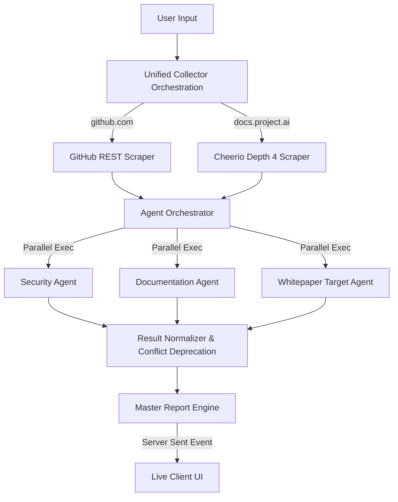

<div align="center">
  
  <h1>ProjectLens AI 🔍</h1>
  <p><b>OKX.AI Genesis Hackathon Submission</b></p>
  <p>An autonomous Agentic Service Provider (ASP) that performs deterministic, multi-agent due-diligence on Web3 infrastructure.</p>
</div>

<p align="center">
  
  
  
  
  
</p>

---

## ⚡ Overview
**ProjectLens AI** is a fully automated, deterministic Due Diligence Pipeline constructed as an ASP (Agentic Service Provider) for the OKX Onchain OS. It transforms hours of manual smart contract auditing, web scraping, and protocol whitepaper digestion into an instantaneous 30-second analytical consensus report.

## 🔴 The Problem Statement
Retail investors consistently lose millions of dollars into malicious, hollow, or functionally broken Web3 ecosystems. Evaluating modern protocols requires cross-referencing GitHub commits, checking smart contract security, and verifying deep Documentation layers. This manual research demands highly specific technical context, leaving standard users incredibly vulnerable to systemic risks.

## 🟢 The Solution
ProjectLens AI acts as a dedicated onchain investigator. Provide a single URL, and the system automatically coordinates a specialized group of AI agents to scour the available architecture, map verifiable infrastructure signals, and mathematically calculate the protocol's risk boundaries.

---

## ✨ Key Features
- **Deterministic Math Engine:** No hallucinated metrics. The AI simply extracts the available architecture, allowing the core routing engine to compute a merciless mathematical score (0-100).
- **Server-Sent Event Streaming (SSE):** Users interact with a stunning real-time CLI terminal emulator directly on the dashboard reflecting every HTTP fetch, Cheerio node traverse, and Gemini SDK execution dynamically.
- **Evidence Cross-Linking:** Every Security 'Finding' provides raw, clickable evidence (e.g. citing `https://github.com/projectlens/Governance.sol#L4`). 
- **Dynamic Crawler:** Scales recursively across up to 4 parallel internal navigational links to prevent shallow single-page scrapes, strictly mapping API references.

---

## 🧠 Architecture & AI Multi-Agent Pipeline



---

## 🧮 How Scoring Works (The Math Engine)
The UI relies strictly on hard mathematical computations preventing the typical generative AI flaw: *Score Inflation*.
1. **Security Integrity (40%)**: Deducts point tiers explicitly matching extracted severe vulnerabilities.
2. **Repository Health (25%)**: Strictly verifiable public metrics mapping Stargazers, Forks, active Contributors, and Tickets.
3. **Documentation Coverage (20%)**: Direct penalty application `(-15pts)` per structural sections missing relative to the architecture graph.
4. **Transparency Base (10%)**: Number of cross-verbified independent structural domains identified.
5. **Tokenomics Model (5%)**: Binary verified/unknown bounds validating circulation logic.

#### The "Unable to Assess" Philosophy (Evidence Coverage)
If the AI scores 40/100, but identifies zero code vulnerabilities, it means the penalty happened because *public evidence was physically missing*. The UI dynamically isolates this contextual difference dynamically rendering: `"The overall score is reduced due to insufficient publicly verifiable evidence, not because critical security vulnerabilities were detected."`

---

## 🛠️ Technology Stack
- **Frontend / Fullstack:** Next.js 15 (App Router), React 19
- **Design System:** TailwindCSS, Shadcn/UI, Lucide Icons, Aceternity UI
- **Generative Intelligence:** Google `Gemini 1.5 Flash` integrated securely via `@ai-sdk/google`
- **Scraping / Utilities:** `cheerio`, `zod` for strongly typed JSON parsing preventing layout failures.

---

## 📁 Project Structure

```text
projectlens-ai/
├── src/
│   ├── app/
│   │   ├── api/analyze/    # Handles the complex SSE Multi-Agent Event Stream
│   │   ├── analyze/        # Next.js Server Client Live Execution Dashboard
│   │   └── report/[id]/    # The Final Rendered Score Visualization Template
│   ├── components/ui/      # Shadcn UI Building Blocks
│   ├── lib/
│   │   ├── agents/         # Zod schemas, System Prompts, Normalization logic
│   │   ├── ai/             # Core Vercel AI SDK wrappers
│   │   └── collectors/     # Headless Cheerio and GitHub REST scrapers
│   └── types/              # Cross-context TypeScript parameters
└── public/                 # Static media and OKX Branding SVGs
```

---

## 🚀 Installation & Local Development

### 1. Prerequisites
- Node.js `20.x` or higher
- A standard Google Gemini API Key

### 2. Environment Setup
```bash
git clone https://github.com/yourusername/ProjectLens-AI.git
cd ProjectLens-AI

npm install
```

Copy the example environment context:
```bash
cp .env.example .env
```
*(Insert your `GOOGLE_GENERATIVE_AI_API_KEY` mapping securely natively)*

### 3. Local Execution
```bash
npm run dev
```
Navigate to `http://localhost:3000` to access the application locally.

### 4. Production Build Verification
To ensure strict TS layout limits and pure compile routes:
```bash
npm run build
npm run start
```

---

## 🔌 API Overview
The core engine powers a streaming route mapped to `POST /api/analyze`.
- **Payload:** Multiform Object containing `githubUrl`, `docsUrl`, or `websiteUrl`.
- **Response:** `text/event-stream` securely blasting AI extraction phases linearly.

---

## 🎬 Links & Resources
- **Live Demo Link:** [Insert Vercel Link]
- **90-Second Demo Video:** [Insert YouTube or X Link]
- **GitHub Repository:** [Insert Repo Link]

### Known Limitations
- Vercel Free-tier functions are aggressively capped at hard max timeout configurations which may sever incredibly long execution vectors on massive mono-repos.

### Roadmap
- Full Smart Contract AST static evaluation natively via Slither.
- Cross-chain transactional graph integration validating token distribution allocations mapped natively natively against extracted whitepaper rules.

---
## 📝 License
This project is mapped explicitly under the **MIT License**.

## 🤝 Acknowledgements & Team
Built entirely asynchronously for the **OKX.AI Genesis Hackathon** mapping massive parallel infrastructure. 
Thank you to the OKX and Vercel AI SDK development platforms! 

---
